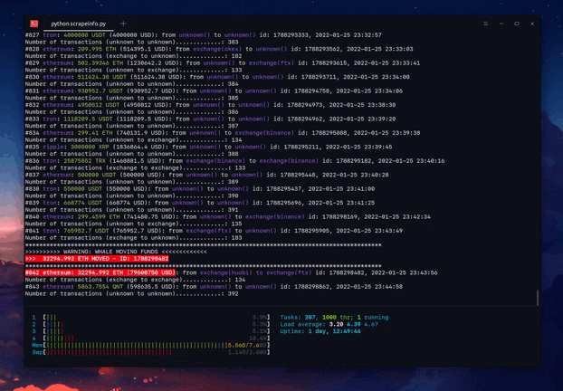

## Whale Alert API

In this API I will focus in data analysisfrom different blockchain's (BTC, ETH and etc) to look for insights in the crypto market.

### TODO's

- Analysis the flow of transactions (In principle this have a high correction with the price):
    - [x] from exchange to unknown wallet
    - [x] from exchange to exchange
    - [x] from unknown wallet to exchange
    - [x] from unknown wallet to unknown wallet

    
    

    **Output**:
    ```bash
    $ python scrapeinfo.py
    0 ethereum: 3137811.2 USDT (3137811.2 USD): from unknown() to unknown() id: 1641350420, 2021-07-03 13:47:49
    Number of transactions (unknown to unknown).............: 1
    1 ethereum: 3137811.2 USDT (3137811.2 USD): from unknown() to exchange(binance) id: 1641350646, 2021-07-03 13:48:21
    Number of transactions (unknown to exchange).............: 1
    2 ethereum: 727615.9 USDT (727615.9 USD): from unknown() to unknown() id: 1641350893, 2021-07-03 13:48:54
    Number of transactions (unknown to unknown).............: 2
    3 ethereum: 887346.1 USDT (887346.1 USD): from unknown() to unknown() id: 1641351173, 2021-07-03 13:49:43
    Number of transactions (unknown to unknown).............: 3
    4 ethereum: 14263.27 QNT (1179009.6 USD): from unknown() to unknown() id: 1641351396, 2021-07-03 13:50:24
    Number of transactions (unknown to unknown).............: 4
    ***********************************************************************************
    >>>>>>>>>> WARNING: WHALE MOVING FUNDS <<<<<<<<<<<<<
    MORE THAN 1000 ETH MOVED
    ***********************************************************************************
    5 ethereum: 1022 ETH (2274826.8 USD): from unknown() to unknown() id: 1641351601, 2021-07-03 13:51:21
    Number of transactions (unknown to unknown).............: 5
    6 tron: 1005060 USDT (1005060 USD): from exchange(binance) to unknown() id: 1641351517, 2021-07-03 13:52:18
    Number of transactions (exchange to unknown).............: 1
    7 ethereum: 899 ETH (1999850.8 USD): from unknown() to unknown() id: 1641352164, 2021-07-03 13:52:42
    Number of transactions (unknown to unknown).............: 6
    8 ethereum: 3500000 USDC (3500000 USD): from exchange(ftx) to unknown() id: 1641352598, 2021-07-03 13:52:51
    Number of transactions (exchange to unknown).............: 2
    ***********************************************************************************
    >>>>>>>>>> WARNING: WHALE MOVING FUNDS <<<<<<<<<<<<<
    MORE THAN 1000 ETH MOVED
    ***********************************************************************************
    9 ethereum: 1022.0125 ETH (2276356.8 USD): from unknown() to unknown() id: 1641352694, 2021-07-03 13:55:25
    Number of transactions (unknown to unknown).............: 7
    10 ethereum: 400 ETH (878557.9 USD): from unknown() to unknown() id: 1641353275, 2021-07-03 13:55:34
    Number of transactions (unknown to unknown).............: 8
    11 ethereum: 898.99445 ETH (1979566.1 USD): from unknown() to unknown() id: 1641355713, 2021-07-03 13:56:48
    Number of transactions (unknown to unknown).............: 9
    12 bitcoin: 33.555996 BTC (1152259.6 USD): from unknown() to unknown() id: 1641356911, 2021-07-03 13:58:58
    Number of transactions (unknown to unknown).............: 10
    13 bitcoin: 89.33393 BTC (3067585.2 USD): from unknown() to unknown() id: 1641353603, 2021-07-03 13:59:06
    Number of transactions (unknown to unknown).............: 11
    14 tron: 1005060 USDT (1005060 USD): from unknown() to unknown() id: 1641353556, 2021-07-03 13:59:14
    Number of transactions (unknown to unknown).............: 12
    15 ethereum: 887346.1 USDT (887346.1 USD): from unknown() to exchange(huobi) id: 1641356071, 2021-07-03 13:59:55
    Number of transactions (unknown to exchange).............: 2
    16 ethereum: 914352 USDT (914352 USD): from unknown() to unknown() id: 1641356259, 2021-07-03 14:00:36
    Number of transactions (unknown to unknown).............: 13
    17 ethereum: 400.996 ETH (883556.06 USD): from unknown() to unknown() id: 1641356341, 2021-07-03 14:00:53
    Number of transactions (unknown to unknown).............: 14
    18 ethereum: 3137865.2 USDT (3137865.2 USD): from unknown() to exchange(binance) id: 1641356567, 2021-07-03 14:01:17
    Number of transactions (unknown to exchange).............: 3
    19 tron: 1999998.9 USDT (1999998.9 USD): from exchange(binance) to unknown() id: 1641356453, 2021-07-03 14:01:42
    Number of transactions (exchange to unknown).............: 3
    20 bitcoin: 28.097506 BTC (968968.6 USD): from unknown() to unknown() id: 1641356952, 2021-07-03 14:01:58
    Number of transactions (unknown to unknown).............: 15
    21 tron: 1999998.9 USDT (1999998.9 USD): from unknown() to exchange(huobi) id: 1641358088, 2021-07-03 14:02:23
    Number of transactions (unknown to exchange).............: 4
    22 tron: 1000000 USDT (1000000 USD): from unknown() to unknown() id: 1641358197, 2021-07-03 14:03:36
    Number of transactions (unknown to unknown).............: 16
    23 tron: 1999998.9 USDT (1999998.9 USD): from exchange(binance) to unknown() id: 1641358237, 2021-07-03 14:04:09
    Number of transactions (exchange to unknown).............: 4
    24 tron: 660000 USDT (660000 USD): from unknown() to unknown() id: 1641358617, 2021-07-03 14:04:25
    Number of transactions (unknown to unknown).............: 17
    25 ethereum: 3400000 USDT (3400000 USD): from exchange(binance) to unknown() id: 1641359127, 2021-07-03 14:05:14
    Number of transactions (exchange to unknown).............: 5
    26 tron: 1660000 USDT (1660000 USD): from unknown() to exchange(huobi) id: 1641359367, 2021-07-03 14:06:19
    Number of transactions (unknown to exchange).............: 5
    27 tron: 500000 USDT (500000 USD): from exchange(binance) to unknown() id: 1641360499, 2021-07-03 14:10:42
    Number of transactions (exchange to unknown).............: 6
    28 tron: 999999 USDT (999999 USD): from exchange(huobi) to unknown() id: 1641360694, 2021-07-03 14:11:14
    Number of transactions (exchange to unknown).............: 7
    29 ethereum: 499.8864 ETH (1105856.1 USD): from exchange(binance) to unknown() id: 1641361248, 2021-07-03 14:11:55
    Number of transactions (exchange to unknown).............: 8
    30 bitcoin: 22.307446 BTC (770833.75 USD): from unknown() to unknown() id: 1641364363, 2021-07-03 14:14:46
    Number of transactions (unknown to unknown).............: 18
    31 bitcoin: 98.214325 BTC (3393796 USD): from unknown() to unknown() id: 1641361875, 2021-07-03 14:15:03
    Number of transactions (unknown to unknown).............: 19
    ```
    NOTE: Here we are using the package ```notify2``` ( a package to display desktop notifications on Linux)
          [notify2 API documentation](https://notify2.readthedocs.io/en/latest/) to install ```pip install notify2``` to nofity the high value moved in one transaction by whale.


- Storage information to analysis the market and to search for standard or metrics to evaluate the ecosystem (**Work in Progress**).
    - transaction (example):
        ```bash
        blockchain: ethereum
        symbol: ETH
        id: 1640685299
        transaction_type: transfer
        hash: 13ea6b3dc2f6bce12f40f4aa48462d308f7cd63906407767ea31a2aa7ae438d1
        from: {'address': '3c047b9dfa4fd8f812f264f1611b959a4dd980f8', 'owner_type': 'unknown', 'owner': ''}
        to: {'address': 'aa344f7b0f781c18f6fba768d5b85f46722b5955', 'owner_type': 'unknown', 'owner': ''}
        timestamp: 1625244742
        amount: 600
        amount_usd: 1264570.1
        transaction_count: 1
      ```

- Black Scholes Model in Python for BTC (**Not yet**)
    - [ ] calls option
    - [ ] puts option
- SuperTrend Indicator in Python (**Work in Progress**)
- Stock Market and Bitcoin Price Relationship — Python Analysis - [stocks_to_BTC.ipynb](whale-alert/notebooks/stocks_to_BTC.ipynb) (**Work in Progress**)

```bash
# requirements for this project.
# requirements.txt
pip3 freeze > requirements.txt

# Install pre requirements, make the command below:
$ pip3 install -r requirements.txt
```
## Resource

- [Whale Alert API Documentation](https://docs.whale-alert.io/?_ga=2.18753593.1286745348.1624886898-1875508501.1610310849#introduction)
- [Whale Alert GitHub](https://github.com/stuianna/whaleAlert)
- [Black Scholes Model in Python for Predicting Options Premiums](https://medium.com/swlh/calculating-option-premiums-using-the-black-scholes-model-in-python-e9ed227afbee)
- [A Step-By-Step Guide to Implementing the SuperTrend Indicator in Python](https://medium.com/codex/step-by-step-implementation-of-the-supertrend-indicator-in-python-656aa678c111)
- [Stock Market and Bitcoin Price Relationship — Python Analysis](https://towardsdatascience.com/stock-market-and-bitcoin-price-relationship-python-analysis-f39f992201c7)
