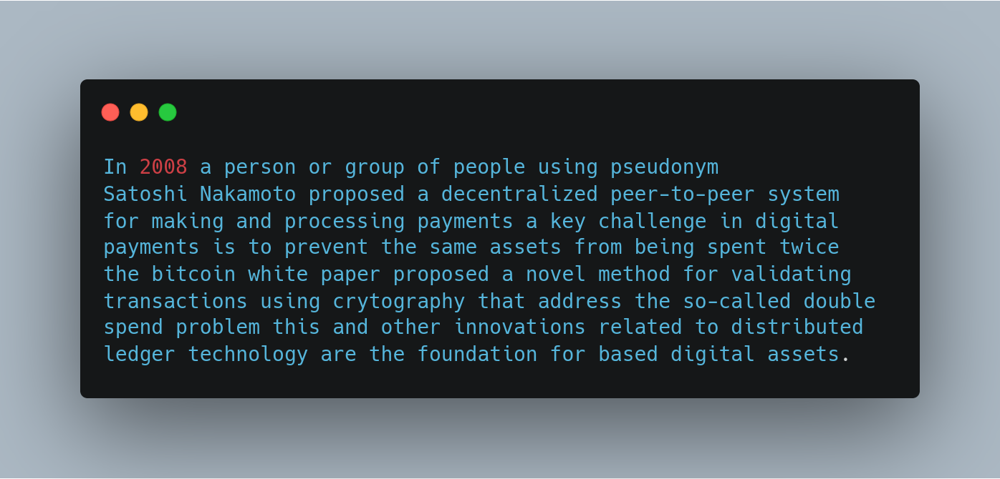
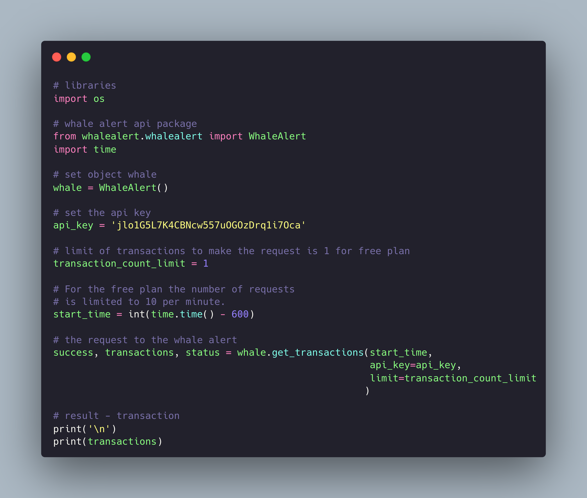
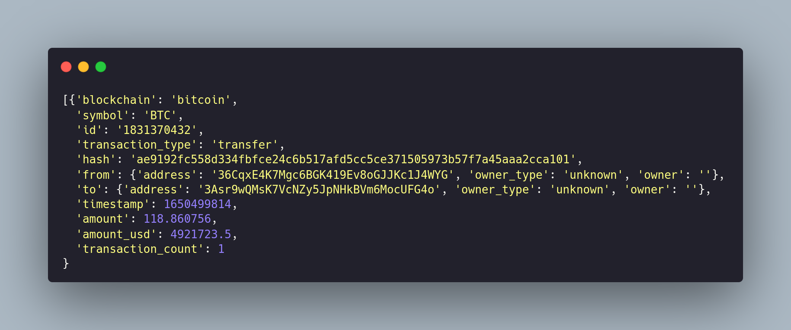
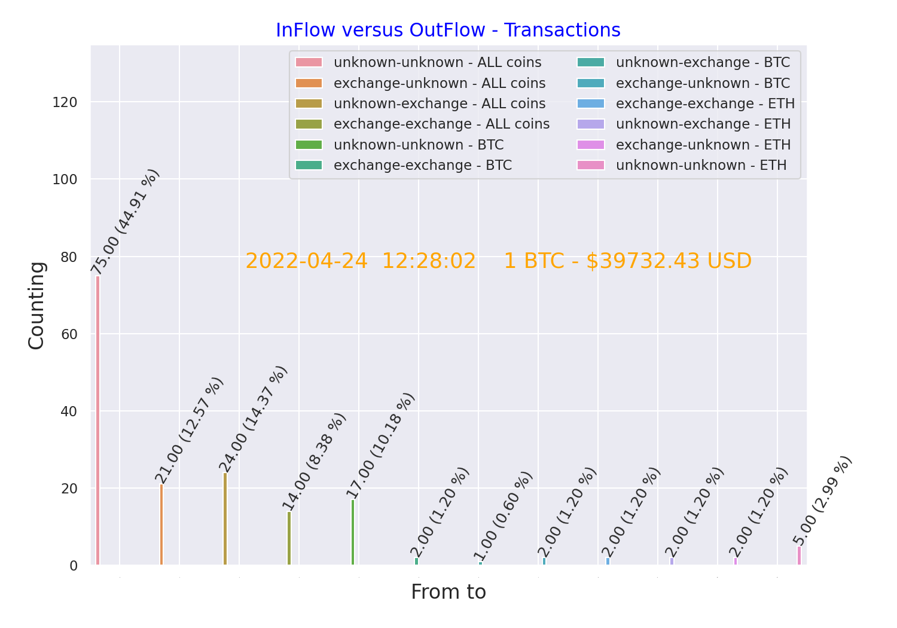
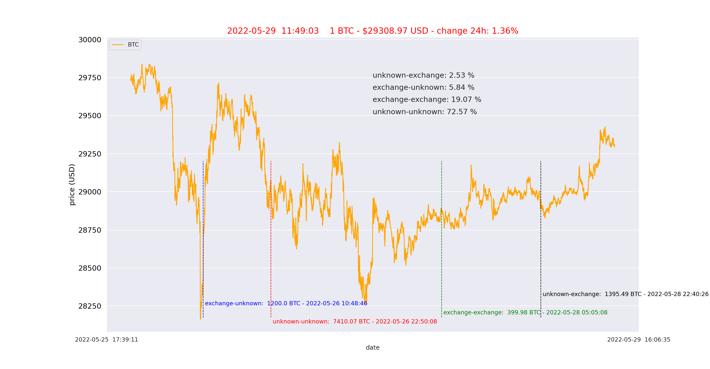

# On-Chain Analysis using the Whale Alert API framework in python.

First, what is On-Chain Analysis? 

To explain this in simple terms, On-Chain Analysis is a way to look into the data and to get extract insights
about the [blockchain](https://academy.binance.com/en/articles/what-is-blockchain-technology-a-comprehensive-guide-for-beginners) fundamentals, as the blockchain is the technology behind the [bitcoin cryptocurrency](https://academy.binance.com/en/articles/what-is-bitcoin) (BTC), basically, blockchain is a public ledger where the transactions are recorded in an immutable database. This database has information to determine crypto market sentiment, sometimes called of On-Chain metrics.

The On-Chain metrics are measured that can provide a big picture about the
Bitcoin network, and the metrics are build through the blockchain data.

Below I will cite the main On-Chain metrics:

- Exchanges inflows/outflows
- Active Address
- BTC Whale Wallet balance (Wallets with more than 1000 BTC)
- BTC hashrate
- BTC mining difficulty
- Mining Reward Value (24hr)
- liquid and illiquid BTC supply

and much more metrics can be found on the most popular providers of on-chain data, like the [Coin Metrics](https://coinmetrics.io/) and [Glassnode](https://glassnode.com/).


The main objective to make On-Chain Analysis is to look into data that 
is basically a thermometer of BTC network and the market to get the current and future price trends of the BTC, based on the metrics.

In this simple tutorial, we will see how to implement On-Chain Analysis for one specific metric called Inflow and Outflow transactions of BTC to exchanges using the [Whale Alert API](https://docs.whale-alert.io/#introduction). 

The [Whale Alert API](https://docs.whale-alert.io/#introduction) already provide all the database organized, we just need to make the request the transaction, below are showed some transactions where each transaction contains, the type
of blockchain, the amount of coins, the amount in US dollars (based on the current transaction price), the origin(```from``` unknown or exchange) of the transaction transferred to another address (```to``` unknown or exchange) and the datetime of the transaction:

```bash
0 ethereum: 578917.8 USDT (578917.8 USD): from unknown() to unknown() id: 1849956779, 2022-05-27 05:09:42
1 tron: 2500000 USDT (2500000 USD): from unknown() to exchange(ftx) id: 1849956880, 2022-05-27 05:10:18
2 tron: 1000000 USDT (1000000 USD): from unknown() to unknown() id: 1849957032, 2022-05-27 05:10:51
3 bitcoin: 22.110264 BTC (642751.44 USD): from unknown() to unknown() id: 1849961425, 2022-05-27 05:11:00
4 bitcoin: 19.043213 BTC (553591.44 USD): from unknown() to unknown() id: 1849957407, 2022-05-27 05:11:18
```

In the market is a consensus that this metric shows a correlation with the price of BTC. I am not an expert in On-Chain Analysis, this is one way to work around with the topic and to learn and to study more about it.

I strong recomend NOT to use this tutorial to make an investiment decision, and the proposal of this example is to study the topic only.

<!--
Hi, I am a Bitcoin enthusiastic and maximalist (almost 99%) and since 2017 I started reading and studying about the crypto market, and now I still reading and studying more and more about it, because I believe what Bitcoin did for the first time in human history. Below the best description that I see so far about Bitcoin:



```bash
In 2008 a person or group of people using pseudonym
Satoshi Nakamoto proposed a decentralized peer-to-peer system 
for making and processing payments a key challenge in digital 
payments is to prevent the same assets from being spent twice 
the bitcoin white paper proposed a novel method for validating 
transactions using crytography that address the so-called double 
spend problem this and other innovations related to distributed 
ledger technology are the foundation for based digital assets.
```
-->

For this article, I will explain and show how to use the [Whale Alert API](https://docs.whale-alert.io/#introduction) to track transaction history data and to make your own analysis from differents blockchains, like Bitcoin, Ethereum, Ripple and others, for more information read the documentation provide by the [Whale Alert API](https://docs.whale-alert.io/#introduction).

In the implementation I will focus **On Chain Analysis** of the BTC blockchain transaction data to look deep dive into **the metric Inflow and Outflow of BTCs**:

- ```from exchange to unknown(wallet)```
- ```from exchange to exchange```
- ```from unknown to exchange```
- ```from unknown(wallet) to unknown(wallet)```

This metric shows a correlation with the price of BTC, because more BTCs flowing to the exchanges, there is a high probability that these BTCs can be sold in the market, i.e. a high strong BTC sales pressure making the price go down, and by the contrary, we expect the price go up, because a high flow of BTCs are going out from exchange to unknown (wallet):

In Summary for this article, I will describe how to build the framework (Using one python package avaliable) to get the data and to make the analysis:

- [1 - Setting the environment to build the framework]()
- [2 - Build the API using the Whale Alert framework]()
  - [2.1 - Whale Alert API How does it works?]()
  - [2.2 - Code to scrape the data from the Whale Alert API]()
- [3 - Analysis the data by making the plots of the Inflow and Outflow of BTC]()

**NOTE**: For this tutorial I will use the Linux Ubuntu 20 to do everything. If you are using Windows the commands will be similars and check on the internet to see how to make this tutorial on Windows to install the framework to develop this API.


### 1 - Setting the environment to build the framework API

First, you need to have the python and pip installed:

```bash
# if you do not have pip installed. 
# you can install it using the CLI - Install python 3
$ sudo apt install -y python3-pip

# packages and development tools to install
sudo apt install -y build-essential libssl-dev libffi-dev python3-dev

# Ubuntu 20:
# # https://www.digitalocean.com/community/tutorials/how-to-install-python-3-and-set-up-a-programming-environment-on-an-ubuntu-20-04-server

# python version
$ python --version
Python 3.9.7

# pip version
$ pip -V          
pip 21.2.4 from ~/anaconda3/lib/python3.9/site-packages/pip (python 3.9)
```

I strong suggest to create python virtual environment to be a self-contained directory tree that includes a Python installation and number of additional packages (This is good practice when you are developing a project, to know more about see the article [A Guide to Python Good Practices](https://towardsdatascience.com/a-guide-to-python-good-practices-90598529da35)). Below I will make the main steps to do this:

Let's begin by installing the ```python3-venv```  package that provides the ```venv``` module

```bash
$ sudo apt install python3-venv
```

If the installation was sucessfully, we can now to create your new virtual environment:

```bash
# Here you can change the name of the project as you like :)
# I am called the project of 'api-blockchain-data'

$ python3 -m venv api-blockchain-data
```

To start using this virtual environment, you need to activate it by running the activate script:

```bash
$ source api-blockchain-data/bin/activate
```

After to set the virtual environment, you can install the python packages that will used in this project:

```bash
## requirements.txt
colored==1.4.3
dash==1.17.0
dash_core_components==1.13.0
dash_html_components==1.1.1
dash_table==4.11.0
icecream==2.1.1
ipython==8.2.0
matplotlib==3.5.1
notify2==0.3.1
numpy==1.22.2
pandas==1.4.1
requests==2.27.1
seaborn==0.11.2
snoop==0.4.0
whale_alert==0.0.4
```

Now you can to install all the packages with only one command, you need to save the package names above in one file called:
```requirements.txt``` on the folder of the project

by typing the following command:

```bash
$ pip install -r requirements.txt
```

**Quick note**: This is a great feature of the python, you can list all the packages used on the project using the following command:

```bash
# requirements for this project.
# requirements.txt
$ pip install freeze

# Install pre requirements, make the command below:
$ pip install -r requirements.txt


# Or if you do not know the package names used on the project, 
# you can use the library 'pipreq' that is a pip installable 
# and automatically generates the file requirements.txt
$ pip install pipreqs
$ pipreqs '/home/project/location/api-blockchain-data'

## It will print:
Successfully saved requirements file in /home/project/location/api-blockchain-data/requirements.txt

# and typing...
$ pip install -r requirements.txt
```

## 2 - Build the API using the Whale Alert framework

To use the Whale Alert API you need to get the API key to do the Authentication to have access to the API service. To create an API key please [sign up here](https://whale-alert.io/signup).

According with the API documentation:

```bash
API rate limiting is dependent on your plan. 
For the free plan the number of requests is limited to 10 per minute. 
The personal plan has a rate limit of 60 per minute. If you need more requests, 
please contact us for an Enterprise account.
```

For this tutorial you can use the ```free plan```. After you have created the API key is good practice to keep the API key save, DO NOT SHARE WITH ANYONE OR COMMIT TO PUBLIC REPOSITORY.

How can I keep the API save? you can set as environment variable in bash shell. To do this open ```~/.bashrc``` and then in the final of the file add the following line:

```bash
export api_key_whale='here go you api key'
```

Save and exit the file. After that you need to source the file ```~/.bashrc``` like this:

```bash
$ source ~/.bashrc
```

To check if everything is right, just type on the terminal:

```bash
$ echo $api_key_whale
```

This will return the api key that was stored on the bash shell. 

Now to get the api key in python, you only need:

```bash
# python file.
import os

api_key = os.environ['api_key_whale']
```

Another way is to store your 'api key' in one file, for example, api_key_wl.txt in the folder of the project in computer and commit to repository. To avoid commit to repository you can add the file name in to the gitignore file:

```bash
## gitignore file has the file names that are not going to the repository
# folder the project and create the file gitignore
$ touch .gitignore

# create the file to store the api key.
$ touch api_key_wl.txt

# add the api key to the file
$ echo "api key" > api_key_wl.txt

# and add the file name to the gitignore
$ echo "api_key_wl.txt" >> .gitignore

#so, Finally:
$ cat .gitignore 
api_key_wl.txt
```

After of All the settings. We are already to start. First, I will show how to use the Whale Alert API library.

<!-- https://replit.com/@andvsilva/whalealert#main.pypi -->


### 2.1 - Whale Alert API How does it works?

To begin this example, first install the python library of the Whale Alert API using pip:
```bash
# install the python package - whale alert
$ pip install whale-alert
```

Now can run the source code below. [The source code here](https://gist.github.com/andvsilva/ced6efe989613bbeb95acea4b4e3e8d7#file-whale_alert_api-py).



**NOTE**: In this example, I put my API key, for this purpose is not a problem, if was for another thing could be a big problem.

When you run the source code, you will see the following result, one BTC transaction, hash, from, to, amount of coins, amount in USD and timestamp:



After this point, I will develop the source code step-by-step of the project to scrape the data from the Whale Alert API and store in a CSV file.

### 2.2 - Collect the data from the Whale Alert API

You already have an idea how the scrape Whale Alert API works, as showed in the example above.

Let's to work, first we need to collect the data from the Whale Alert API and store it in a CSV file. To do this, you can run the source code ([github-repo](https://github.com/andvsilva/webscraping/blob/master/whale-alert/source-code/scrapewhale.py)) and second run the [code make plot](https://github.com/andvsilva/webscraping/blob/master/whale-alert/make-plots/plot_from_to_usd.py).

```bash
# run the script to collect the data
~/whale-alert/scripts-shell on  master! ⌚ 18:44:26
$ source runscrape.sh
0 ethereum: 844167.44 USDT (844167.44 USD): from unknown() to unknown() id: 1832775765, 2022-04-23 18:39:35
1 ethereum: 1032427.4 USDT (1032427.4 USD): from exchange(ftx) to unknown() id: 1832775897, 2022-04-23 18:41:02
2 tron: 500000 USDT (500000 USD): from unknown() to unknown() id: 1832775963, 2022-04-23 18:42:24
3 ethereum: 1032427.4 USDT (1032427.4 USD): from unknown() to unknown() id: 1832776140, 2022-04-23 18:43:40
4 ethereum: 508875.72 USDT (508875.72 USD): from unknown() to unknown() id: 1832776323, 2022-04-23 18:46:17
5 tron: 1000000 USDT (1000000 USD): from unknown() to unknown() id: 1832776310, 2022-04-23 18:46:30
6 bitcoin: 96.48055 BTC (3845014.5 USD): from unknown() to unknown() id: 1832776540, 2022-04-23 18:47:58
...
20 bitcoin: 22.371284 BTC (890562.94 USD): from unknown() to unknown() id: 1832786314, 2022-04-23 19:17:00
21 bitcoin: 18.748873 BTC (746360.9 USD): from unknown() to unknown() id: 1832784061, 2022-04-23 19:17:29
******************************************************************************************************
>>>>>>>>>> WARNING: WHALE MOVING FUNDS <<<<<<<<<<<<<
>>>  749.99915 ETH MOVED - ID: 1832786268
******************************************************************************************************
22 ethereum: 749.99915 ETH (2219658.5 USD): from unknown() to exchange(ftx) id: 1832786268, 2022-04-23 19:19:19
23 ethereum: 403.994 ETH (1196410.5 USD): from exchange(okex) to unknown() id: 1832787354, 2022-04-23 19:20:09
24 bitcoin: 50.49085 BTC (2023115.2 USD): from unknown() to unknown() id: 1832786351, 2022-04-23 19:22:08
...
```

Now we already have the Blockchain data, we can analysis the transaction history and looking for insights that are related to the price BTC. I will examine the data in the next section.

## 3 - Analysis the data from Inflow and Outflow of BTC

In the analysis, I start look in the flow of BTC transactions, i.e. the number of transactions ```from to``` (inflow and outflow).

The following image shows the result of the collect of the data from the Whale Alert, where we have the counting of the transactions **inflow** and **outflow** with from to destiny - "from to" ('unknown-unknown', 'unknown-exchange','exchange-unknown' and 'exchange-exchange').

```Inflow and Outflow of transactions:```
| 
|:--:| 
| Fig.2: Counting of InFlow and OutFlow transactions **from to** as described in the legend of the plot.|

```bash
# to generate the plot above run the script:
~/whale-alert/scripts-shell on  master! ⌚ 11:55:30
$ source runplot_counting_txo.sh
```

The next step is deep look into BTC transactions ```from to``` and get the higher amount of BTC in transactions to seek and investigate if exist a significant correlaction with the BTC price.

Now to get the price versus date plot, you just need to run the following command line:

```bash
## terminal
## pwd to the folder - make-plots
~/webscraping/whale-alert/make-plots on  master! ⌚ 17:43:00
$ python price_btc_ioflow.py
```

```BTC price versus date:```
| 
|:--:| 
| Fig.1: BTC price versus date with a percentage of transactions **from to** and Alerts that shows the higher transactions as described in the legend of the plot.|

This plot shows the higher amount of BTC moved ```from to``` with the price at the moment of the transaction. The plot also shows the percentage of transactions for each transaction type, with the following values:

- exchange-unknown: 1200 BTC (~34 Million of USD)
- unknown-unknown: 7410.07 BTC (~215 Million of USD)
- exchange-exchange: 399.98 BTC (~11.5 Million of USD)
- unknown-exchange: 1395.49 BTC (~40.2 Million of USD)

From this analysis, the result suggest that there is
a correlation, But I cannot yet make any conclusion, I need to work around and make more analysis or looking for evidences
to support my thesis. For the transaction (exchange-unknown) showed on the plot, we see that the price rise up about 5%, this
is what we were expecting, the price goes up.

In my opinion, I think that the percentage of amount of transactions can provide a good level of precision for the macro sentiment about the crypto market, i.e., high amount of transactions (exchange-unknown) suggest that the price goes up, because the amount of BTC on the exchange is low and demand increase, and the contrary can also happen push the price down.

That is it for now, this article shows only how to work with Whale Alert API in python package to do analysis from blockchain data, and now up to you to try improve this framework showed or to build your own analysis, to seek for insights from data.

Thank you for taking the time to read this article! Stay turn and never stop, the journey is long and we need to be strong and disciplined to reach the success in the field.

To know more about me see my [webpage](https://medium.com/r/?url=https%3A%2F%2Fandsilvadrcc.gitlab.io%2Fmy-web-page-andre-vieira%2F).

Cheers! Until the next time. :)

## References

- [Bitcoin: A Peer-to-Peer Electronic Cash System](https://bitcoin.org/bitcoin.pdf)
- [The Bitcoin Standard: The Decentralized Alternative to Central Banking](https://www.resistance.money/research/library/to%20be%20organised%20better/The%20Bitcoin%20Standard.pdf)
- [The Scalability Trilemma in Blockchain](https://aakash-111.medium.com/the-scalability-trilemma-in-blockchain-75fb57f646df)
- [On Sound Money](https://medium.com/galaxy-digital-research/on-sound-money-afc0619697b3)
- [BITCOIN’S ON-CHAIN MARKET CYCLES](https://bitcoinmagazine.com/markets/bitcoins-on-chain-market-cycles)
- [An Introduction To On-Chain Analysis](https://medium.com/quantum-economics/an-introduction-to-on-chain-analysis-9d233ec1e418)
- [Carbon -> Create and share beautiful images of your source code](https://carbon.now.sh/)